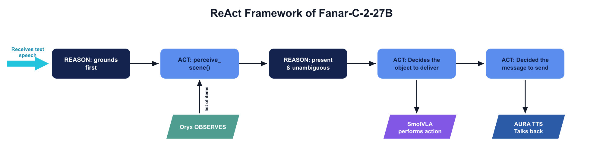

<!-- _paginate: false -->
# بَصير · Baseer
### An Arabic voice-controlled assistive robot arm

**عيونك ويدك، بكلمة منك — your eyes and hands, at your word.**

Fanar Hackathon 2026 · Physical AI · Accessibility / Patient Support
GitHub: github.com/fatma936-sudo/baseer · Page: fatma936-sudo.github.io/baseer

<!-- Speaker: Baseer = "the one who sees." A robot arm that becomes the eyes and hands of a blind person, driven entirely by spoken Arabic. -->

---

## The problem  ·  *Problem Definition & Impact (25%)*

> For a blind person, the hard part of daily life isn't *deciding* what they want — it's **finding and reaching** it.

- **Control barrier** — assistive arms are joystick/teleop driven; they assume sight + fine motor control the user doesn't have.
- **Language barrier** — voice assistants & robots are English-first; an elderly, blind, **Arabic-speaking** user is left out.
- **The gap = natural, dialectal Arabic** as the interface to a *physical* helper — exactly what Fanar is built to close.

<!-- Open with a scene: "You can't see your dressing table; you know the serum is there, but reaching the right one is the daily struggle." -->

---

## Impact & value proposition  ·  *(25%)*

- **Independence & dignity** for visually-impaired Arabic speakers — daily tasks without a caregiver.
- **Arabic-first** assistive robotics — a template, not an afterthought.
- The **intelligence is genuinely Fanar's**; the system proves it by **failing gracefully** — for an assistive tool, that *is* the product.
- Demo use case: a **vanity** — fetch perfumes / skincare on spoken request, hand them to a fixed delivery zone.

*(295M+ people live with moderate-to-severe vision loss worldwide — a large, underserved Arabic-speaking population.)*

---

## What Baseer does  ·  the four "organs"

| Organ | Technology | Job |
|---|---|---|
| 🧠 **Brain** | `Fanar-C-2-27B` | understand dialect, decide, disambiguate, refuse safely |
| 👁️ **Eyes** | `Fanar-Oryx-IVU-2` | read labels — *which* item, *where* it is |
| 🗣️ **Voice** | Aura ASR + TTS (Noor) | hear + speak back in the user's dialect |
| 🦾 **Muscle** | **SmolVLA** on SO-100 | grasp + deliver, with closed-loop retry |

**A hierarchical VLA:** Fanar = task-level Vision-Language→Action (actions = tool calls); SmolVLA = low-level motor control.

---

## How easy is it (for the user)?  ·  *UX (10%)*

> One tap. Your voice. Done.

1. **Tap & hold** — the *entire* screen is the button (nothing to see or find).
2. **Speak** naturally, any dialect: *"ناوليني سيروم الشعر."*
3. It **fetches it and replies aloud, in your dialect**: *"تفضّل، سيروم الشعر أمامك."*

❌ No app to install ❌ No menus/buttons ❌ No sight needed ❌ No English
**Two-phase voice:** *"دقيقة، أجيب لك السيروم"* → (arm works) → *"ها هو السيروم"*

---

## System architecture  ·  *Agentic Design (30%)*

```
 iPad (thin client)  ──HTTPS──▶  Laptop (orchestrator)  ──API──▶  Fanar Cloud
  tap-to-talk                     server.py (FastAPI)             Aura ASR/TTS
  audio in/out                    agent loop (ReAct)              Fanar-C-2-27B
                                  tools: perceive/deliver/say/ask  Fanar-Oryx
                                       │
                                  SO-100 arm + SmolVLA (local)
       OFFLINE: teleop demos → lerobot-record → train SmolVLA → checkpoint
```

- Hard constraint: USB serial + camera live on the host → laptop runs the control loop; phone is mic+speaker; GPU box trains **offline only**.

---

## Agentic workflow  ·  *(30%)*



<!-- ReAct loop: Fanar emits ONE JSON action per turn (native tool-calling didn't work → JSON state machine). Grounds before acting, disambiguates, fails gracefully, multi-step, retries. -->

---

## The hard part  ·  *Technical Innovation (30%)*

**Turning one spoken word into a precise grasp is a stack of hard problems.**

- **Voice → action:** dialectal ASR mishears brands; Fanar emits no `tool_calls` → drove it as a **JSON action state-machine** + normalization + grounding.
- **Vision:** look-alike products → needed a **VLM that reads labels** (Oryx); boxes jitter → query ×3 + median.
- **Localization & control (the wall):** single RGB camera, **no depth** → ~cm aim error; learned pixel→pose map + fixed slots + top-down — each closer, but monocular cm-precision is an open problem.
- **Closed-loop grasp:** success by **motor torque + gripper width**; **retry** on a miss.

---

## SmolVLA — the grasp policy  ·  *Technical (30%)*

**What it is**
- Compact open-source **Vision-Language-Action** model (LeRobot / Hugging Face)
- **~450M params**, backbone = **SmolVLM-2 (500M)** vision-language model
- VLM encodes camera + the **language task** → a **flow-matching action expert** outputs **action chunks** (predicts several steps per inference → runs real-time on modest hardware, even Apple-Silicon MPS)
- **Language-conditioned:** the instruction text selects the behavior

**How we trained it**
- Base: `lerobot/smolvla_base` → fine-tuned with `--policy.type=smolvla`
- Data: **28 teleop episodes** (13 hair serum + 15 face serum), 1 front cam 640×480@30, SO-100 6-DoF, two language tasks
- **20,000 steps, batch 32, ~6.5 h** on an NVIDIA RTX 6000 (24 GB) → **final loss 0.012**
- Deploy: pulled checkpoint → runs on the MacBook (MPS) at **~20 Hz**

---

## Physical pipeline — `deliver(item)`

```
Oryx locate target ─▶ pre-position above it ─▶ SmolVLA grasp
        ─▶ VERIFY: torque (current) + gripper width  ──miss──▶ retry
        ─▶ HELD ─▶ carry (clear obstacles) ─▶ set down level ─▶ release
```

- **Grasp verification** is sensor-free: an empty gripper closes fully (low current); an object holds the fingers open at its width (high current).
- **Level set-down:** places the object at the *same wrist angle it was grasped* so it doesn't tip.
- **Two-phase deliver:** ack immediately, grasp in the background, confirm when done.

---

## Effective use of Fanar  ·  *(20%)*

**Four Fanar models, each doing a job only Fanar does well — all Arabic-native:**

| 🧠 Brain | 👁️ Eyes | 🗣️ Voice |
|---|---|---|
| `Fanar-C-2-27B` | `Fanar-Oryx-IVU-2` | `Aura STT-1` + `Aura TTS-2` |
| decide & disambiguate | read labels, localize | hear + speak the dialect |

> No English anywhere in the loop — dialect in, dialect out, vision and reasoning all in Arabic.

*(next 3 slides: how we used each)*

---

## Fanar-C-2-27B — the reasoning brain

**Role:** the agentic decision-maker — understands the request, plans, picks tools, refuses safely.

**How we used it**
- **ReAct loop**: emits one action per turn — `perceive_scene` / `deliver` / `say` / `ask`.
- **Dialect → action directly**: Gulf / Egyptian / Levantine / MSA + dialectal item names (العطر/البرفان…) mapped to the catalog — **no translation step**; replies *in the same dialect*.
- **Grounds before acting** (perceive → confirm → deliver), **disambiguates** ("أي سيروم؟"), **fails gracefully**, handles **multi-step** requests.

**What we learned**
- Native **tool-calling returns empty `tool_calls`** → we drive it as a **JSON-action state machine** (`response_format=json_object` + strict few-shot) — the single change that made it reliable.
- **Safety filter** fires on benign Arabic → **retry-with-backoff**.

---

## Fanar-Oryx-IVU-2 — the eyes (VLM)

**Role:** perception — sees the table, identifies *which* items are there, and *where*.

**How we used it**
- **`describe_scene`** — grounded to a **product registry** (brand + color/shape): returns which catalog items are present, by **reading the printed brand text** (e.g. Kérastase vs Vichy).
- **`locate_scene` / `locate_one`** — returns **pixel bounding boxes** to aim the arm; we query **×3 and take the median** to smooth VLM jitter, and clean label formatting.
- Powers **disambiguation**: sees two serums → the agent asks which.

**Why Oryx (not a plain detector)**
- YOLO-World failed on look-alike cosmetics (conf 0.06–0.12, can't read scents). **Oryx reads the label** → distinguishes them. *Limitation:* box precision is ~cm-level and jittery → fine for identity, not yet for blind grasping.

---

## Aura — the voice (ASR + TTS)

**Role:** the user's *only* I/O channel — hears Arabic, speaks Arabic back.

**How we used it**
- **Aura ASR (`STT-1`)**: tap-to-talk audio → Arabic text (dialect-robust).
- **Aura TTS (`TTS-2`, voice Noor)**: speaks every reply **in the user's dialect** (Fanar writes the dialect text; Aura renders it). Disk-cached; **two-phase**: *"دقيقة…"* then *"ها هو…"*.

**What we learned**
- ASR **fuses multi-word brands & over-diacritizes** ("عطر ديور"→"عِطراديور"), and misheard **"السيروم"→"السيرة"** (religiously loaded) → tripped the safety filter. Fixed with **`normalize.py`** (diacritic strip + alias map) *before* Fanar.
- Shared **rate limits** → TTS **disk-cache** + fixed-phrase reuse; never leak raw errors → always speak a clean retry.

---

## Evaluation & insights  ·  *(15%)*

**What works (verified live):** dialect understanding, disambiguation ("which serum?"), graceful failure, voice round-trip, Oryx label-reading, SmolVLA grasp (loss 0.012), torque+width verification, two-phase dialect replies.

**Fanar findings (lessons learned):**
- Native **tool-calling returns empty `tool_calls`** → we used a JSON-action protocol + `response_format=json_object`.
- **Safety filter false-positives** on benign Arabic → retry-with-backoff.
- **Aura ASR fuses brand names / over-diacritizes** ("عطر ديور"→"عِطراديور") → `normalize.py` before Fanar.
- **`GET /models`** returns under `"models"` not OpenAI's `"data"`.

---

## Recommendations for Fanar  ·  *(15% / 20%)*

1. **Make tool-calling actually emit `tool_calls`** — biggest agentic-DX win; today every team needs a JSON workaround.
2. **Reduce safety-filter false-positives** on benign Arabic; expose the trigger / a severity setting.
3. **Aura ASR:** entity/brand robustness + an un-diacritized output option.
4. **Higher, per-capability rate limits + `Retry-After`** for live multimodal demos.
5. **Ship a Fanar-native VLA** (on Fanar-Oryx), fine-tunable in LeRobot format → a *genuine* Fanar robot policy.

---

## Demo & deliverables  ·  *(10%)*

- **Live demo:** speak on the iPad → Oryx perceives → SmolVLA grasps → arm delivers → Aura confirms, in dialect.
- ✅ Working prototype (full voice→arm stack)
- ✅ **GitHub** repo · detailed technical **README**
- ✅ **Model** on Hugging Face (`55CancriE/baseer-smolvla-serums`)
- ✅ **Dataset** on Hugging Face (`55CancriE/baseer_serums`, 28 eps)
- ✅ **Project page** (GitHub Pages)

---

## Honest limitations & future work

- **Single RGB camera, no depth** → precise multi-object localization isn't reliable yet (the arm can grasp, but choosing the *exact* small object among several needs more).
- **Next:** depth camera or **hand-eye IK calibration** for cm-precision; more demos per object; extend to ACT / π0 / GR00T (one-flag swap, GPU permitting).

---

<!-- _paginate: false -->
## بَصير · Baseer
### Where the intelligence is genuinely Fanar's, the impact is dignified, and the system proves it by failing gracefully.

**voice → Fanar reasoning → Oryx perception → SmolVLA grasp → Aura reply — all in Arabic.**

github.com/fatma936-sudo/baseer · fatma936-sudo.github.io/baseer
